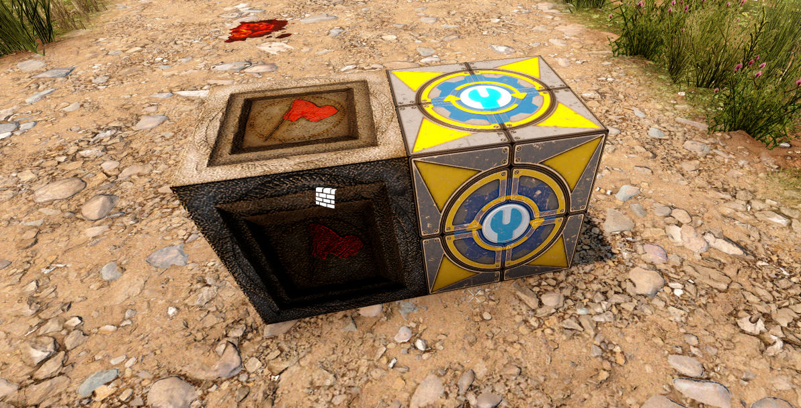
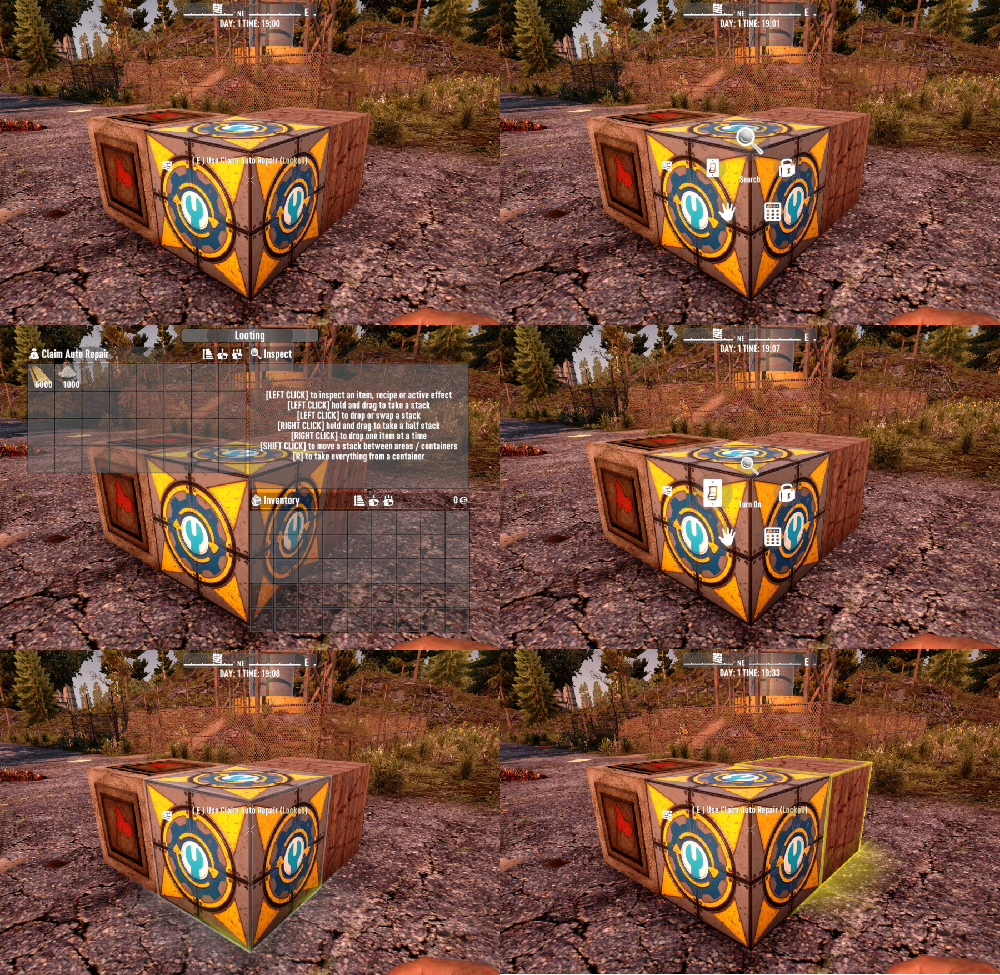

# OCB Claim Auto Repair Mod - 7 Days to Die (V1.0) Addon

A new block that will automatically repair damaged blocks within your claim.
Introduces a new block that is based on a storage chest. You need to put in
materials that are then used to repair random blocks within its vicinity.
The auto repair block has it's own (slightly increased) range, but will only
repair blocks that are within your or your allies claim (block the owner
could also pickup). So it's recommended to place the auto repair block
close to your actual claim block. Btw. they don't repair themselves.



The block will slowly and randomly try to pick blocks around its perimeter
and checks if it needs repair and if the required material are in the storage.
Once those prerequisites are met, the actual repair will start. Blocks are not
gradually repaired, but rather take time to fully restore the durability. If a
block that is being repaired is further damaged, the auto repair is aborted.
You should hear a sound from the box when it is repairing blocks and also if
a block in repair is further damaged (and repair in progress is aborted).

[![GitHub CI Compile Status][4]][3]

## How to use

Make sure you have placed a Land-Claim Block, otherwise it will not work!



- Place the block within claimed land
- Interact with the Block by pressing `E`
- Open the box inventory and put in repair materials
- Make sure to enable the auto repair block (hold `E`)
- Once enabled, you should see a gray outline around the box
- Wait for it to find a damaged block it can repair (yellow outline)

## Undead Legacy Support

This mod is compatibly with Undead Legacy out of the box, e.g. no further
compatibility patches are needed. But you will need to make sure that this
mod loads after the regular undead legacy mods. You can e.g. accomplish
this simply by *renaming the folder* to `ZClaimAutoRepair`.

## Block finding and Repair speed

Given the big range a repair block covers, finding a specific damaged block
can take quite a bit of time. Consider that when more blocks are damaged, the
random finding of damaged blocks has a much higher chance. If only one single
block is damaged, finding that one can take quite a bit of time.

Repair speed has been increased from A19 version, since I agree it was a tad
bit slow, specially if you have many high hit-point blocks. Although the pace
is still at a leisurely pace. I don't want this block to be overpowered. It
should repair a fairly damaged base within 7 hours though and you can always
build additional repair blocks. They might randomly interfere with each other
but repair should still work (and be faster).

I've made some measurements and will gladly report my findings, although yours
may vary for whatever reason (calculations are tick and time delta based).
Internally the repair speed is currently set to `2000f` (just a factor).
With that base factor you can expect around the following repair speeds:

- Each tick (sound you hear) it repairs around 65 hit-points
- This sums up to around 5000 hit-points in one in-game hour
- Or around 125K hit-points per in-game day or 875k in a week
- Or 75 fully damaged 10k blocks between horde-nights (6 days)

## Further improvements

I reduced the storage size to have a bit more UI real-estate to add more
info and maybe modifier-slots to further increase repair-speed etc.
It would be nice to have a better indication what the box is actually doing.
For now I only added some sounds and an outline, since that was pretty easy.
Another thing would be to require power for the box to work. Ultimately an
NPC doing something similar would be killer, but needs AI and path-finding.

### Download and Install

[Download from GitHub releases][2] and extract into your Mods folder!  
Ensure you don't have double nested folders and ModInfo.xml is at right place!

## How to compile

I've included a MSVC solution file and also a simple batch file to use my
[Mod Compiler Utils][1]. Both solutions require one environment variable
`PATH_7D2D_MANAGED` to be set. This is needed in order to find the correct
game dlls for the compilation. Note that the resulting dlls will be put under
`build/bin/target/AutoClaimRepair.dll`. It should be copied automatically
by the MSVC post compile task.

```batch
PATH_7D2D_MANAGED=G:\steam\steamapps\common\7 Days To Die\7DaysToDie_Data\Managed
```

## Changelog

### Version 0.9.2

- Recompile for 7D2D V1.2 stable

### Version 0.9.1

- Fix issue with bound helper being too big

### Version 0.9.0

- Compatibility with V1.0 stable (b333)

### Version 0.8.1

- Add initial config for darkness falls A21 compatibility  
  Unlocks at laborer class Advanced Engineering Level 4
  Or with any other class at workbench perk level 3

### Version 0.8.0

- Update compatibility for 7D2D A21.0(b313)

### Version 0.7.5

- Fix issue not reporting missing land claim
- Improve multiplayer support for new features

### Version 0.7.4

- Fix issue with outline not moving fast enough
- Fix high CPU usage (left dev mode on in 0.7.3)
- Add compatibility (recipes etc.) for Undead Legacy
- Also chat about missing land claim block

### Version 0.7.3

- Shows red outline if land claim is found missing
- Shows orange outline if repair materials missing
- Progresses outline from yellow to green on repair
- Chats you about last missing material when opened

### Version 0.7.2

- Add Chinese translations (thx fatmanlegend)
- Automated deployment and release packaging


### Version 0.7.1

- Expose repair speed factor to block xml config  
  Property is named `ClaimAutoRepairSpeedFactor`

### Version 0.7.0

- Refactored for A20 compatibility (native mod now)
- Reduced storage size for UI space (e.g. modified slots)
- Increased base repair speed from 750 to 2000

[1]: https://github.com/OCB7D2D/A20BepInExPreloader
[2]: https://github.com/OCB7D2D/OcbClaimAutoRepair/releases
[3]: https://github.com/OCB7D2D/OcbClaimAutoRepair/actions/workflows/ci.yml
[4]: https://github.com/OCB7D2D/OcbClaimAutoRepair/actions/workflows/ci.yml/badge.svg
